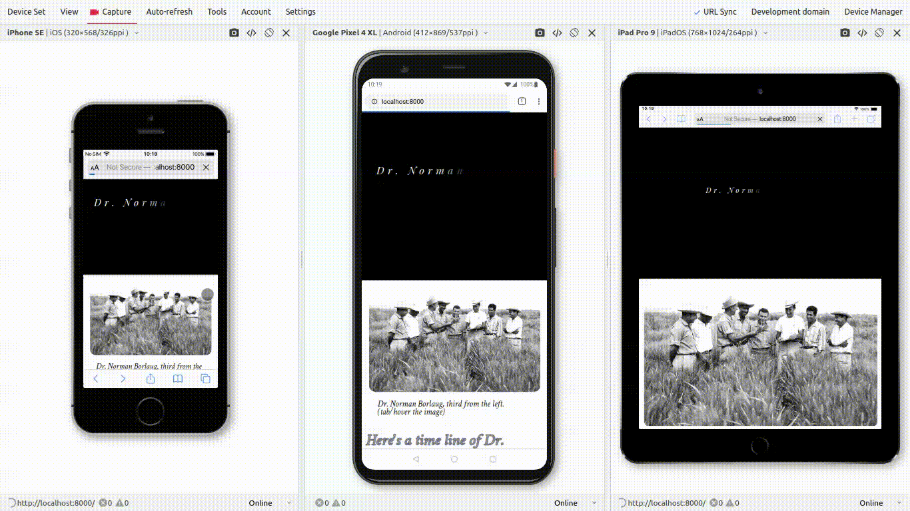

<h1 align="center">Welcome to Tribute Page 👋</h1>

A Dr.  Norman  Borlaug tribute page as a [Free Code Camp](https://www.freecodecamp.com/challenges/build-a-tribute-page) front-end project where I show some important events and achievements in the doctor's life.
### 🏠 [Homepage](https://abdelghanymh.github.io/fcc-tribute-page/)

## ✨ Demo




## 🚀 Usage
1. Clone the Repository  
	> git clone https://github.com/abdelghanyMh/fcc-tribute-page.git
	> 
	> cd fcc-tribute-page

1. run this  command to run the site in localhost: 
`python -m http.server`
3. To access to this site from local machine 
`http://localhost:8000`
4. To access from local network
	```bash
	#Get local Ip address of the host
	read -r _{,} gateway _ iface _ ip _ <  <(ip r g 1.0.0.0)
	printf  '%-12s %s\n' gateway $gateway iface $iface  ip  $ip  
	#gateway 192.168.1.1
	#iface eth0
	#ip 192.168.1.9  #ip address of host machine 
	```
 - from another local machine write this in the url
 `http://192.168.1.9:8000/`


## Built with
<p align="left"> <a href="https://www.w3schools.com/css/" target="_blank">  </a> <a href="https://www.w3.org/html/" target="_blank">  </a> <a href="https://developer.mozilla.org/en-US/docs/Web/JavaScript" target="_blank">  </a> <a href="https://sass-lang.com/guide" target="_blank">  </a> </p>


## Show your support

Give a ⭐️ if you liked this  project !
